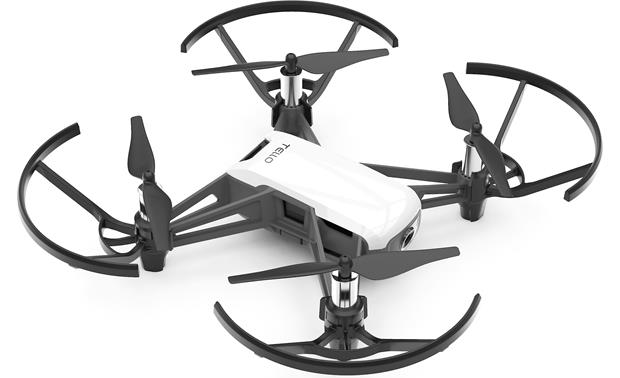

# Secuencia_de_movimiento_DJI_Tello_Dron_ROS

   

 Este es un repositorio para el control basico a base de una serie de movimientos programados para el dron DJI Tello.

## Descripcion general del proyecto
Este proyecto se utilizara el dron DJI Tello programable a traves de una conexion wifi con el dron, el principal objetivo del proyecto es desarrollar un repositorio para el control basico del dron DJI Tello a traves de una secuencia de movimientos programados, para ello utilizaremos el middleware robótico ROS, programado a traves de Python 3.

## Requisitos
Para poder realizar este proyecto necesitas los siguientes elementos:

- Ubuntu 20.04 ()
- ROS Noetic ()
- Python 3 ()
- Libreria DJITelloPy ()

